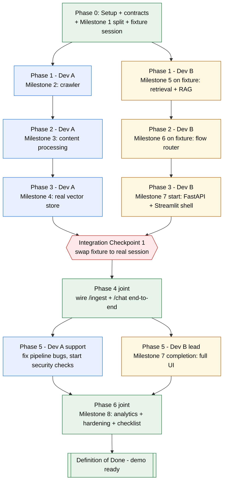

# Team Plan — 2-Person Phase-Wise Work Split

> Companion to [FINAL_PLAN_IMPROVED.md](FINAL_PLAN_IMPROVED.md) (product plan, Milestones 1-8 in §32) and [architecture.md](architecture.md) (system design). This document assigns ownership of each milestone to one of two developers and defines how they work in parallel without blocking each other.

## 1. Roles

The architecture already has a natural seam between its two pipelines: **ingestion** (URL → crawl → clean → chunk → embed → index) and **conversation serving** (chat → route → retrieve → generate → cite). Split the team along that exact seam:

| | Owns | Primary folders |
|---|---|---|
| **Dev A — Ingestion & Knowledge Base** | Crawling, cleaning, service detection, chunking, embedding, FAISS index build | `ingest/`, `app/vectorstore.py` |
| **Dev B — Conversation, RAG & UI** | Bedrock chat, retrieval, evidence gate, flow router, FastAPI serving, Streamlit UI | `app/` (except `vectorstore.py`), `ui/` |

Both: `requirements.txt`, `.env`, the shared data contracts below, and `tests/`.

## 2. The Key Trick: Decouple With a Fixture Session

The plan's milestones are written sequentially (build the vector store, *then* build retrieval), which would leave Dev B idle while Dev A builds the crawler. Avoid that:

1. Day one: agree the **chunk/document metadata schema** ([§13](FINAL_PLAN_IMPROVED.md#13-document-metadata)), **manifest.json schema** ([§27](FINAL_PLAN_IMPROVED.md#27-ingestion-manifest)), and **SQLite schema** ([§26](FINAL_PLAN_IMPROVED.md#26-data-model)).
2. Dev A hand-builds a tiny **fixture session** — 3-4 fake HTML pages, manually chunked, embedded once, saved as `data/sessions/fixture_demo/{index.faiss,chunks.json,manifest.json}` — before the real crawler exists.
3. Dev B builds retrieval, the evidence gate, the grounded prompt, the flow router, and the FastAPI/Streamlit shell entirely against `fixture_demo`.
4. When Dev A's real pipeline is ready, swap the fixture for a real crawled session — this is **Integration Checkpoint 1** below.

Both devs write and test real code from Phase 1 onward; nobody waits idle on the other's pipeline.

## 3. Phase-by-Phase Plan

### Phase 0 — Foundations (joint)
- Scaffold repo folders per [§31](FINAL_PLAN_IMPROVED.md#31-file--project-structure): `ingest/`, `app/`, `ui/`, `tests/`, `data/sessions/`; add `requirements.txt`, `.env.example`.
- Agree the contracts in §2 above, plus API request/response shapes ([§23](FINAL_PLAN_IMPROVED.md#23-api-contract)).
- Split **Milestone 1** (Bedrock): Dev A → Titan Embed wrapper + smoke test; Dev B → Nova Pro Converse wrapper + smoke test. Merge both into `app/bedrock.py`.
- Dev A builds the `fixture_demo` session (§2).

**Done when:** both Bedrock calls work standalone and `fixture_demo` exists.

### Phase 1
| | Milestone | Tasks |
|---|---|---|
| Dev A | **2** — URL validation + crawler | URL validator, canonicalizer, robots.txt check, SSRF-safe fetch + redirect revalidation, bounded BFS (max 20 pages, depth, size), link extraction |
| Dev B | **5**, early, on fixture | Query embedding, FAISS top-k search, evidence gate, grounded Nova Pro prompt + citation extraction — all against `fixture_demo` |

**Done when:** Dev A — a real URL produces a bounded set of retained raw pages. Dev B — a question against `fixture_demo` returns a grounded, cited answer.

### Phase 2
| | Milestone | Tasks |
|---|---|---|
| Dev A | **3** — Content processing | HTML cleaning, title/heading extraction, service detection, structure-aware chunking, metadata generation, raw/cleaned persistence |
| Dev B | **6**, on fixture | Deterministic flow router cascade (`greeting → service_list → service_detail → follow_up → general_qa → fallback`, see [architecture.md §4.6](architecture.md#46-intent--flow-routing--decision-cascade)), session state (`current_service`/`last_flow`/`last_sources`) |

**Done when:** Dev A — each retained page becomes quality chunks with metadata. Dev B — router passes the evaluation set ([§33](FINAL_PLAN_IMPROVED.md#33-evaluation-set)) against `fixture_demo`.

### Phase 3
| | Milestone | Tasks |
|---|---|---|
| Dev A | **4** — Session-scoped vector store | Embed chunks, build FAISS `IndexFlatIP`, persist index/chunks/manifest, verify reload after restart — on a **real** crawled site |
| Dev B | **7**, start | FastAPI skeleton (`app/main.py`, `config.py`), Streamlit shell (URL input, crawl-status placeholder, chat placeholder) wired to `fixture_demo` |

**Done when:** Dev A — a real session reloads and retrieves correctly after restart.

### 🔗 Integration Checkpoint 1 (joint)
Swap Dev B's `fixture_demo` for Dev A's real pipeline output. Run one real end-to-end crawl → chat test together and fix any contract mismatches while both are present.

### Phase 4 (joint)
Wire `POST /ingest` (triggers Dev A's `ingest/pipeline.py`) and `POST /chat` (runs Dev B's router + RAG) for real; persist `crawl_jobs`/`messages`/`flow_events` via `app/db.py`; implement crawl-failure handling ([§28](FINAL_PLAN_IMPROVED.md#28-handling-crawl-failures)).

**Done when:** URL → crawl → services → chat-with-sources works through the real API.

### Phase 5
| | Tasks |
|---|---|
| Dev B (lead) | **Milestone 7** completion — full Streamlit UI: progress bar, services list, chat, sources, error/loading states |
| Dev A (support) | Expose crawl-progress fields the UI needs; fix pipeline bugs found during UI integration; start **Milestone 8** security checks (SSRF tests, robots.txt tests, redirect revalidation) |

**Done when:** the entire experience works from one Streamlit page ([§34](FINAL_PLAN_IMPROVED.md#34-definition-of-done)).

### Phase 6 — Analytics + hardening (joint, Milestone 8)
- Analytics: Dev A supplies crawl-side fields, Dev B supplies flow/retrieval-side fields, merged in `app/analytics.py`.
- Run the Verification Checklist ([§35](FINAL_PLAN_IMPROVED.md#35-verification-checklist)) split by section: Dev A → ingestion/knowledge base, Dev B → Q&A/conversation/UI.
- Test edge cases ([§28](FINAL_PLAN_IMPROVED.md#28-handling-crawl-failures), [§33](FINAL_PLAN_IMPROVED.md#33-evaluation-set)): Dev A → crawl edge cases, Dev B → routing edge cases + prompt-injection test.

**Done when:** the Definition of Done ([§34](FINAL_PLAN_IMPROVED.md#34-definition-of-done)) passes end-to-end and the demo is rehearsed.

## 4. File Ownership (avoid merge conflicts)

| Dev A | Dev B |
|---|---|
| `ingest/*.py` (all) | `app/config.py`, `sessions.py`, `retrieval.py`, `rag.py`, `flows.py`, `analytics.py`, `db.py`, `main.py` |
| `app/vectorstore.py` | `ui/streamlit_app.py` |
| `tests/test_crawler.py`, `test_canonicalizer.py` | `tests/test_retrieval.py`, `test_flows.py`, `test_questions.json` |

Shared, coordinate before editing: `app/bedrock.py` (two independent functions, low conflict risk), `requirements.txt`, `.env`.

## 5. Diagram

