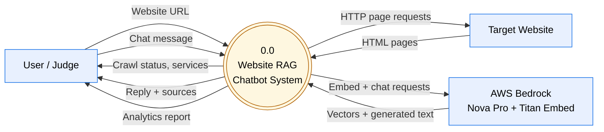
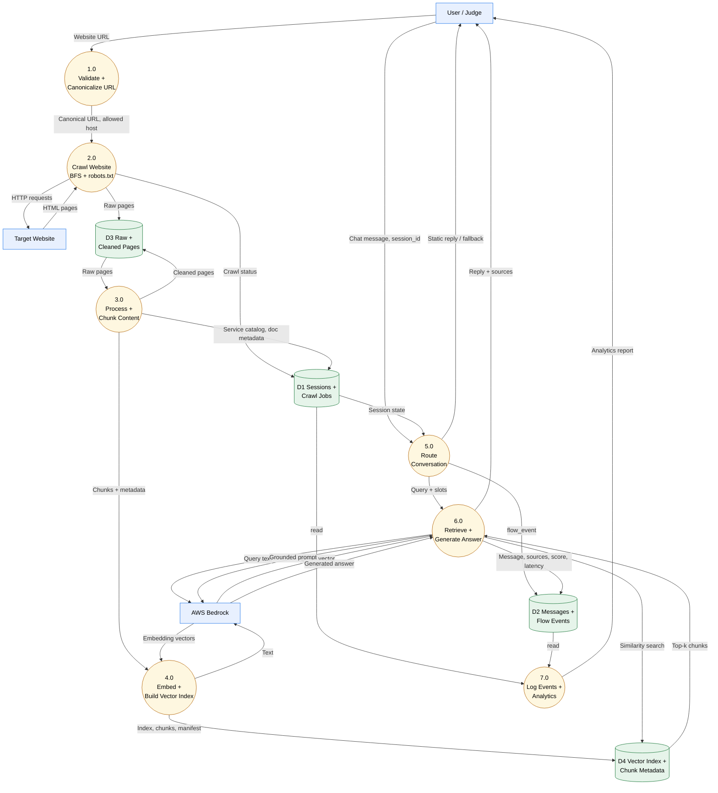
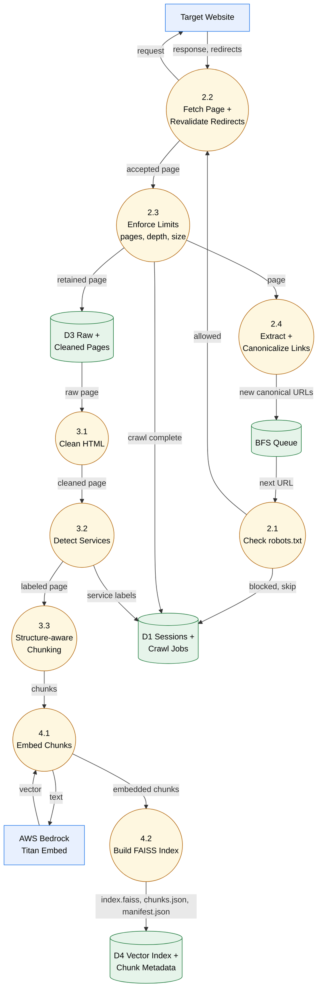
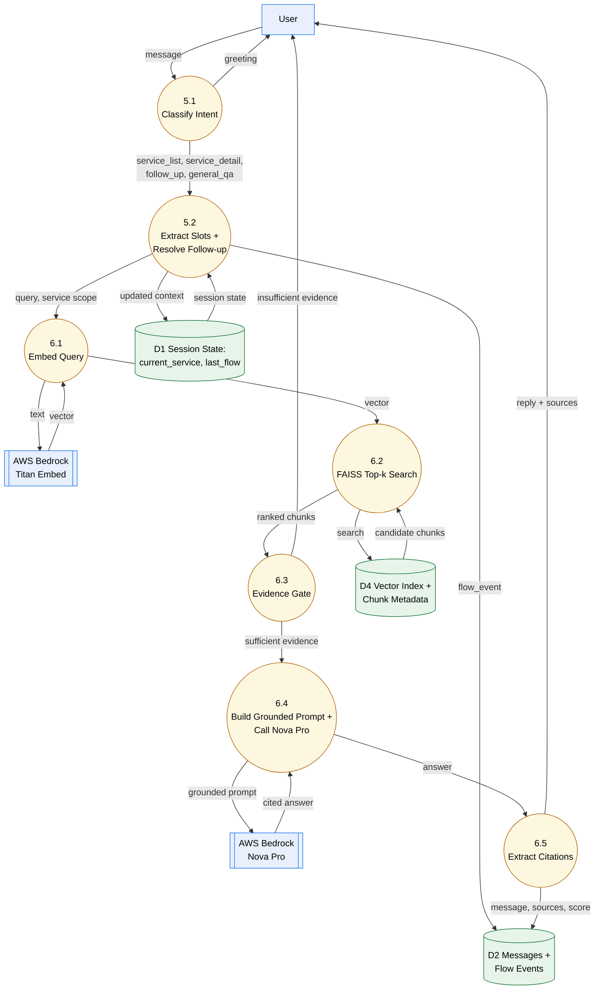
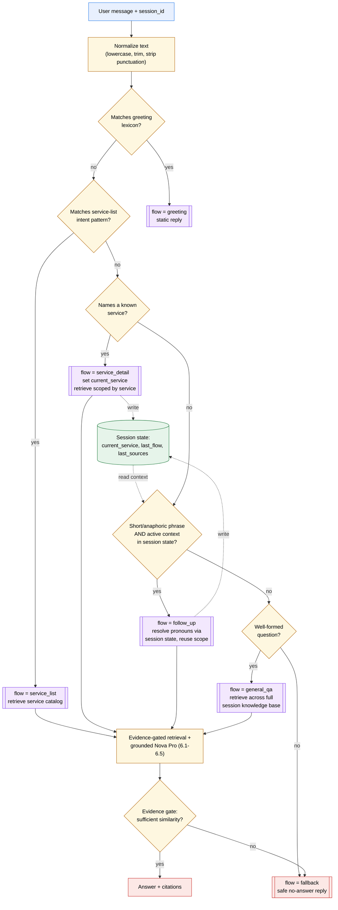
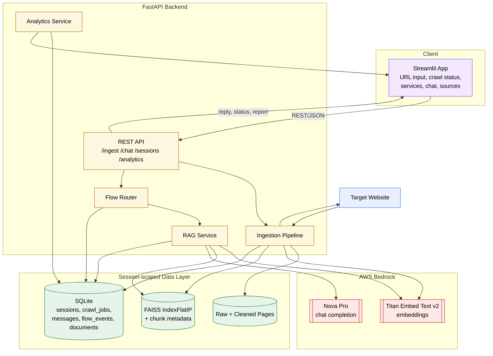
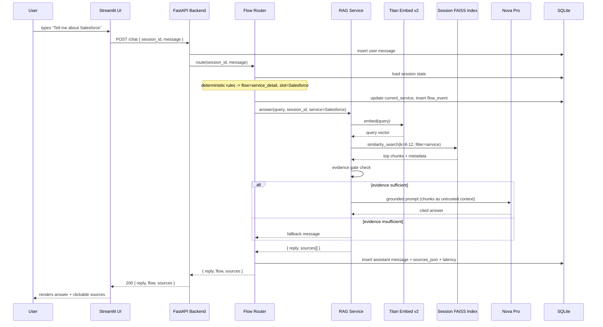

# Architecture — Dynamic Website RAG Flow-Aware Chatbot

> **Status:** Planning-stage hackathon MVP — no application code exists yet. This document specifies the target architecture and data flow, derived from [FINAL_PLAN_IMPROVED.md](FINAL_PLAN_IMPROVED.md), the authoritative product plan.

**Core promise:** Enter a website, crawl up to 20 relevant pages, build a temporary knowledge base, and ask questions about that website with answers grounded in its content and accompanied by source links.

The system has two primary pipelines that share a common session boundary:

- **Ingestion pipeline** — URL → validate → crawl → clean → detect services → chunk → embed → session-scoped vector index.
- **Conversation pipeline** — chat message → deterministic flow routing → evidence-gated retrieval → grounded LLM answer → citations.

---

## 1. Goals and Non-Goals

| In scope (MVP) | Out of scope (this phase) |
|---|---|
| User-provided URL, same-domain BFS crawl (max 20 pages) | Arbitrary multi-domain crawling |
| Deterministic, rule-based flow routing | LLM-based intent classification per turn |
| FAISS `IndexFlatIP`, one index per crawl session | Cloud-hosted / distributed vector DB |
| SQLite persistence (sessions, messages, events) | Production data warehouse / analytics stack |
| Streamlit UI | Multi-user auth, embeddable widget |
| Evidence-gated, citation-backed answers | Reranking, hybrid BM25 + vector search |
| Static-HTML scraping (`requests` + `BeautifulSoup`) | Playwright / JS-rendered crawling |

## 2. Tech Stack

| Layer | Choice |
|---|---|
| UI | Streamlit |
| Backend | FastAPI |
| Chat model | Amazon Nova Pro (`amazon.nova-pro-v1:0`) via Bedrock Converse API |
| Embeddings | Amazon Titan Embed Text v2 (`amazon.titan-embed-text-v2:0`) |
| Vector store | FAISS `IndexFlatIP`, session-scoped |
| Relational store | SQLite (sessions, crawl_jobs, messages, flow_events, documents) |
| Scraper | `requests` + `BeautifulSoup`, static HTML only |
| Raw storage | Local filesystem, per-session `raw/` + `cleaned/` |

## 3. Feature Inventory

Every feature maps to a numbered process in the [Data Flow Diagrams](#4-data-flow-diagrams-dfd) below, so the DFD can be read as a diagram of the product's features.

| # | Feature | DFD process |
|---|---|---|
| 1 | Website URL intake, validation and canonicalization | 1.0 |
| 2 | SSRF-safe, robots.txt-aware, bounded BFS crawl (max 20 pages) | 2.0 |
| 3 | HTML cleaning and service discovery | 3.0 |
| 4 | Heading-aware, structure-preserving chunking | 3.0 |
| 5 | Titan embeddings and session-scoped FAISS index build | 4.0 |
| 6 | Deterministic conversation flow routing | 5.0, [4.6](#46-intent--flow-routing--decision-cascade) |
| 7 | Conversation context and follow-up resolution | 5.0 |
| 8 | Evidence-gated top-k retrieval | 6.0 |
| 9 | Grounded, cited Nova Pro answers with prompt-injection defenses | 6.0 |
| 10 | Session-isolated knowledge base (one crawl = one namespace) | D1 / D4 |
| 11 | Persisted sessions, messages, flow events, crawl jobs | D1 / D2 |
| 12 | Flow and retrieval analytics report | 7.0 |
| 13 | Streamlit UI: URL input, crawl status, services, chat, sources | Client |

## 4. Data Flow Diagrams (DFD)

### 4.1 Notation

| Shape | Meaning |
|---|---|
| Rectangle | External entity — outside the system boundary (user, target website, Bedrock) |
| Circle | Process — transforms, routes, or generates data |
| Cylinder | Data store — persisted state (SQLite tables or FAISS/filesystem) |
| Labeled arrow | Data flow — direction and payload of data in motion |

### 4.2 Level 0 — Context Diagram



### 4.3 Level 1 — System-Wide Data Flow



### 4.4 Level 2 — Website Ingestion Pipeline (decomposes 2.0 – 4.0)



### 4.5 Level 2 — Conversational RAG Pipeline (decomposes 5.0 – 6.0)



### 4.6 Intent / Flow Routing — Decision Cascade

Intent handling is **deterministic and rule-based**, not an LLM classification call. This keeps every turn fast, free, and fully explainable/testable (see the evaluation set in [FINAL_PLAN_IMPROVED.md](FINAL_PLAN_IMPROVED.md#33-evaluation-set)). The router (process 5.1/5.2) evaluates a fixed, ordered cascade of rules against the normalized user message and the session's stored conversation state; the **first matching rule wins** and assigns exactly one flow.

**Order of evaluation** (first match wins):

1. **`greeting`** — message matches a small greeting lexicon (hi, hello, hey, good morning, ...). Answered with a static response; no retrieval, no LLM call.
2. **`service_list`** — message matches "what services / what do you do / what do you offer" style patterns. Retrieves the session's service catalog (built during ingestion) rather than running open-ended retrieval.
3. **`service_detail`** — message names (or fuzzy-matches) one of the session's known services (e.g. "Salesforce"). Sets `current_service` in session state and scopes retrieval with a `service=` metadata filter.
4. **`follow_up`** — message is short/anaphoric ("tell me more", "what about its pricing", "and benefits?") **and** `current_service` or `last_flow` exists in session state. Resolves pronouns/ellipsis using that stored context instead of the raw message.
5. **`general_qa`** — none of the above matched, but the message is a well-formed question. Falls through to unscoped retrieval across the full session knowledge base.
6. **`fallback`** — nothing matched, or matched but the evidence gate (process 6.3, downstream of routing) later finds insufficient similarity. Returns a safe "I couldn't find that" reply instead of a hallucinated answer.

Only flows 3-5 call Titan/FAISS/Nova Pro; `greeting` and `fallback` short-circuit before any retrieval or generation cost is incurred. Every routing decision — matched flow, confidence/rule id, and whether an answer was ultimately produced — is written to `flow_events` for analytics (process 7.0).



| Flow | Trigger | Session state used | LLM/retrieval? |
|---|---|---|---|
| `greeting` | Greeting lexicon match | none | No — static reply |
| `service_list` | "what services/do you offer" pattern | none | Retrieval only (service catalog) |
| `service_detail` | Named/fuzzy-matched known service | writes `current_service` | Retrieval + Nova Pro, filtered by `service` |
| `follow_up` | Short/anaphoric phrase + existing context | reads + refreshes `current_service`/`last_flow` | Retrieval + Nova Pro, scope inherited from context |
| `general_qa` | Well-formed question, no other match | none | Retrieval (unscoped) + Nova Pro |
| `fallback` | No rule matched, or evidence gate rejects | none | No generation — safe no-answer message |

#### 4.6.1 Compound / Multi-Intent Messages

A single user message can legitimately contain more than one intent, e.g.:

```text
"Hi! What services do you offer, and do you also do Salesforce work?"
   └─ greeting ─┘ └───── service_list ─────┘  └───── service_detail ─────┘
```

The router is single-flow-per-turn by design (MVP), so it resolves this in two steps rather than trying to satisfy every clause at once:

1. **Greeting-prefix stripping.** `greeting` only matches when the *entire* normalized message is a greeting/pleasantry (exact or near-exact lexicon match). Before running the cascade, a leading greeting token/clause ("hi", "hello there", "hey,") is stripped from the message; the remainder continues through the cascade instead of the whole message short-circuiting into a static `greeting` reply. This alone resolves the common "Hi, <real question>" case.
2. **First-match-wins on the remaining substantive intents.** If more than one *non-greeting* rule still matches (e.g. the message both asks for the service list and names a specific service), priority order (`service_list` → `service_detail` → `follow_up` → `general_qa`) decides the single flow for this turn. The unmatched clause is **not** silently answered — it is simply not addressed yet.
3. **Deferred remainder becomes a natural follow-up.** Because `last_flow`/`current_service`/`last_sources` are persisted every turn, the un-answered clause is normally what the user asks next ("...and what about Salesforce?"), which the `follow_up` rule then resolves using the state written by this turn.

This is a **documented MVP limitation, not a bug**: true multi-intent handling (splitting a message into clauses and answering each with its own retrieval + evidence gate, then merging citations) is listed as a stretch goal, not required for the core promise in [FINAL_PLAN_IMPROVED.md §36](FINAL_PLAN_IMPROVED.md#36-stretch-goals). If it's needed for the demo, the lowest-effort upgrade is a pre-router clause splitter (split on "and", "also", "?") that runs the cascade per clause and returns one answer per matched clause with its own citations, still using the same evidence gate per clause.

## 5. Component Architecture



## 6. Sequence Diagram — Sample Chat Turn



## 7. Session and Knowledge Isolation

> One user website crawl = one isolated knowledge session.

Each session owns its own vector index, chunk metadata, and raw/cleaned pages, so content from one website never leaks into another website's Q&A:

```text
data/sessions/<session_id>/
├── raw/              # saved raw HTML per retained page
├── cleaned/          # cleaned text per retained page
├── index.faiss        # session-scoped FAISS IndexFlatIP
├── chunks.json         # chunk text + metadata, aligned to index vectors
└── manifest.json       # crawl + embedding summary for the session
```

Conceptual session record:

```json
{
  "session_id": "abc123",
  "website_url": "https://example.com",
  "normalized_host": "example.com",
  "status": "ready",
  "pages_crawled": 18,
  "chunks": 143,
  "services": ["Salesforce", "Data Engineering"]
}
```

## 8. Data Model

```text
sessions(
    id, website_url, normalized_host, status,
    created_at, updated_at,
    pages_discovered, pages_retained, chunks, meta
)

crawl_jobs(
    id, session_id, status,
    started_at, finished_at,
    pages_discovered, pages_retained, pages_failed, error
)

documents(
    id, session_id, url, title, service, status, created_at
)

messages(
    id, session_id, role, content, flow,
    sources_json, retrieval_score, latency_ms, created_at
)

flow_events(
    id, session_id, flow, confidence, matched, answered, created_at
)
```

## 9. API Contract

| Endpoint | Purpose | Response highlights |
|---|---|---|
| `POST /ingest` | Phase 1: crawl a URL and build its site map, creates a session | `{ session_id, job_id, status }` |
| `GET /ingest/{job_id}` | Poll crawl/build progress | `{ status, pages_discovered, pages_retained, pages_failed, chunks, services, sitemap: { pages, failures } }` |
| `POST /ingest/{job_id}/build` | Phase 2: turn a ready site map (`status="sitemap_ready"`) into a queryable knowledge base | `{ session_id, job_id, status }` |
| `POST /chat` | Ask a question within a session | `{ reply, flow, sources: [{title, url}] }` |
| `GET /sessions/{session_id}` | Full transcript + crawl status + services | website, crawl status, services, messages, flow events |
| `GET /analytics/report?session_id=` | Flow and retrieval analytics | pages crawled, fallback rate, latency, top sources |

`crawl_jobs.status` progresses `queued -> crawling -> sitemap_ready -> building -> done`
(or `failed` at any stage). Chat is only unlocked once status is `done`.

Example:

```json
POST /chat
{ "session_id": "abc123", "message": "Tell me about Salesforce" }

200 OK
{
  "reply": "...",
  "flow": "service_detail",
  "sources": [
    { "title": "Salesforce Services", "url": "https://example.com/services/salesforce" }
  ]
}
```

## 10. Security Architecture

- **SSRF protection** — allow only `http`/`https`; resolve and validate the hostname; reject localhost/private/internal destinations; restrict crawling to the initial site's allowed host.
- **Redirect revalidation** — every redirect target is re-validated against the same host/network checks as the original URL; the original URL's validity does not carry over to its redirect target.
- **Bounded crawling** — hard cap of 20 retained pages, configurable max depth, request timeout, and response-size limit protect against unexpectedly large or hostile sites.
- **robots.txt compliance** — checked before every fetch.
- **Prompt-injection defense** — retrieved website content is passed to Nova Pro as explicitly untrusted reference data; the system prompt instructs the model never to follow instructions embedded in that content.
- **Evidence gate** — the model is never forced to answer; insufficient similarity triggers a safe fallback instead of a hallucinated response.
- **Secrets handling** — AWS credentials stay server-side (FastAPI backend); never exposed to the Streamlit/browser client.
- **Storage isolation** — vector indexes and SQLite files are kept outside any publicly served static directory.

## 11. Repository Structure

```text
hackathon/
├── architecture.md
├── FINAL_PLAN_IMPROVED.md
├── requirements.txt
├── .env
├── .gitignore
│
├── data/
│   └── sessions/
│       └── <session_id>/
│           ├── raw/
│           ├── cleaned/
│           ├── index.faiss
│           ├── chunks.json
│           └── manifest.json
│
├── ingest/
│   ├── url_validator.py
│   ├── canonicalizer.py
│   ├── robots.py
│   ├── crawler.py
│   ├── extractor.py
│   ├── service_detector.py
│   ├── chunker.py
│   └── pipeline.py
│
├── app/
│   ├── config.py
│   ├── bedrock.py
│   ├── sessions.py
│   ├── vectorstore.py
│   ├── retrieval.py
│   ├── rag.py
│   ├── flows.py
│   ├── analytics.py
│   ├── db.py
│   └── main.py
│
├── ui/
│   └── streamlit_app.py
│
└── tests/
    ├── test_crawler.py
    ├── test_canonicalizer.py
    ├── test_retrieval.py
    ├── test_flows.py
    └── test_questions.json
```

## 12. References

- [FINAL_PLAN_IMPROVED.md](FINAL_PLAN_IMPROVED.md) — full product plan, milestones, verification checklist, and evaluation set.
